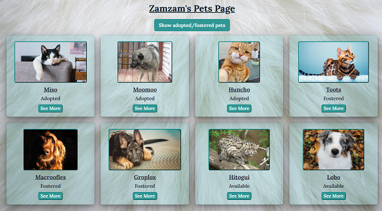

### Pet Adoption Full Stack Project

[Project deployment link](https://ag-petadoption.onrender.com)  
Free hosted server, so it is somewhat slow.

Full-stack web project, fully developed by me.  
A mock website for browsing through a large selection of different pets, and adopting/fostering them.
##

### Main Implementation
Project is written in MERN stack.

#### Back End
- REST API, done in the Model–View–Controller architecture.
- Server is written in Node Express, with Object Data Modeling done in Mongoose.
- The database is stored online on a MongoDB Atlas cluster.
- Images are uploaded using Multer NPm, and are stored on Cloudinary.
- Server routes include authentication and validation, using 'AJV' schemas and 'JWT' tokens.
- User passwords are encrypted, using 'Bcrypt'.

#### Front End
- The client side is written in React.
- Design and styling are done with Chakra-UI.
- Page routing and route-protection done with react-router-dom npm.

##
### Description

#### Home Page

Home/landing page and welcome message. also contains:

- Real time activity feed for latest actions by users and changes to pets.
- Slideshow showing a random pets. Changes every few seconds. For logged-n users, clicking links to the pet's page.
- Our mascots, the hyper-laser cat and dog.

 

#### Sign-up/Log-in

A Login/Sign-up. Button for it is on a nav-bar.  
Basic validation is in place on the form, and more rigid authentication takes place on the back-end.  

 

#### Pets Browse

Search for a pet from the database.  
Several parameters available to search by.  
Advanced search available only to logged-in users.  
Search results will be displayed in a grid of small pet cards.  
Cards will link to full pet page card.

 

#### Pet Card

Card page for a specific pet from the database.  
Contains information about the pet, as well as actions available for it, ie: save/adopt/etc.  
The available actions vary according to the pet's adoption status, and their relation to the user.  
For instance:  
"Adopt"/"Foster" will only be available if the pet was not adopted/fostered by another user.  
"Return" will only be available if the pet is already owned by the current user.  
"Edit"/"Delete" will only be available for administrators.

 

#### User Profile

Profile page for registered users.  
Contains the user details and bio with the option to edit them,  
and links to the lists of pets the user has saved/adopted/fostered.

 

#### Admin Dashboard

Administrator exclusive page, which contains:

- Option to add a new pet.
- A detailed list of all registered users.   
Each row links to its user's profile and pets lists, and an option to edit their details and make them an admin.
- A detailed list of all pets in the database, including the pet's adoption status and owner (if they have one).  
Each row links to its pet's page.

 

##
### General features

- Users will only have access to certain pages and actions based on their access level. 
- User access levels:
  -  Guest (not logged in): Home screen and basic search only.
  -  Registered (logged in): Home, profile page, advanced search, pet cards with ability to adopt/foster/save pets.
  -  Administrator: All registered user access, plus: Able to add/edit/delete pets, view/edit other users profiles.

- Logged users may perform the following actions on the pets in the website:
  - **Adopt/foster:** Only doable for pets that were not adopted/fostered by another user.  
  The user will then become the pet's owner, and it will no longer be available for other users to adopt/foster.  
  Will add the pet to the user's pets-page on their profile, under "adopted/fostered pets".
  - **Save:** Doable for all pets.  
  Acts as a bookmark by adding any pet to the user's pets-page on their profile, under "saved pets".
  - **Return:** Only doable for pets the user has previously adopted/fostered.  
  Will make the pet available for other users again.  
  Removes the pet from the user's pets-page on their profile.
  - **Unsave:** Only doable for pets the user has previously saved.  
  Removes the pet from the user's pets-page on their profile.
  - Administrator only actions:
    - **Delete:** Removes the pet from the database, and from the lists of any users who owned or saved it.
    - **Edit:** Change the pet's details.

- Users remain logged in for the next session, using to local storage of 'JWT' tokens.

##

:)
