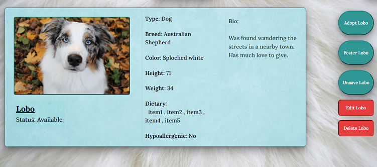
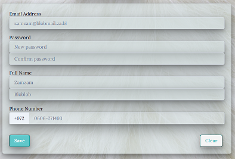

### Pet Adoption Full Stack Project

Full-stack web project, fully developed by me.  
A mock website for browsing through a large selection of different pets, and adopting/fostering them.
##

### Implementation

#### Back End
- The database is stored online on a MongoDB Atlas cluster.
- Server is written in Node express, with Object Data Modeling done in Mongoose.
- Routes include authentication and validation using Jason web tokens.
- User passwords are encrypted.

#### Front End
- The client side is done in React and designed with Chakra-UI.
- Page access and actions are restricted depending on user (guest / registered / admin).

##
### Description
#### Home Page

Simple home page and welcome message.    
Login/Sign-up and navigation menu on the nav-bar.  
Basic validation in place for login/sign-up.  

The options on the navigation menu will be limited according to the user's access level.

#### Pets Browse

Search for a pet from the database.  
Several parameters available to search by, advanced search available only to logged-in users.  
Search results will be displayed in the form of small pet cards.  
Cards will link to full pet page card.

#### Pet Card

Card page for a specific pet from the database.  
Contains general details, as well as buttons for actions available to the users relating to the pet, ie: save/adopt/foster.  
The available actions vary depending on the pet's adoption status, and their relation to the user.  
For example:  
"Adopt"/"Foster" will only be available if the pet was not adopted/fostered by another user.  
"Return" will only be available if the pet was adopted/fostered specifically by the current user.  
"Edit" pet will only be available for admins.

#### User Profile

Profile page for registered users.  
Contains the option to add a short bio, and links to the lists of pets the user has saved/adopted/fostered.

#### Admin Dashboard
Administrator exclusive page, which contains:
- A detailed list of all registered users. Links to their profile and pets lists, and an option to edit their details and make them an admin.
- A detailed list of all pets in the database, including the pet's adoption availability and owner (if they have one). 
- Option to add a new pet.

##
##### General features
- Users that didn't log out will remain logged in on next session, thanks to local storage of jwt.
- Users will only have access to certain pages and actions based on their access level.
- User access levels:
  -  Guest (not logged in): Home screen and basic search only.
  -  Registered (logged in): Home, profile page, advanced search, pet cards with ability to adopt/foster/save pets.
  -  Administrator: All registered user access, plus: Able to add/edit/delete pets, view/edit other users profiles.

